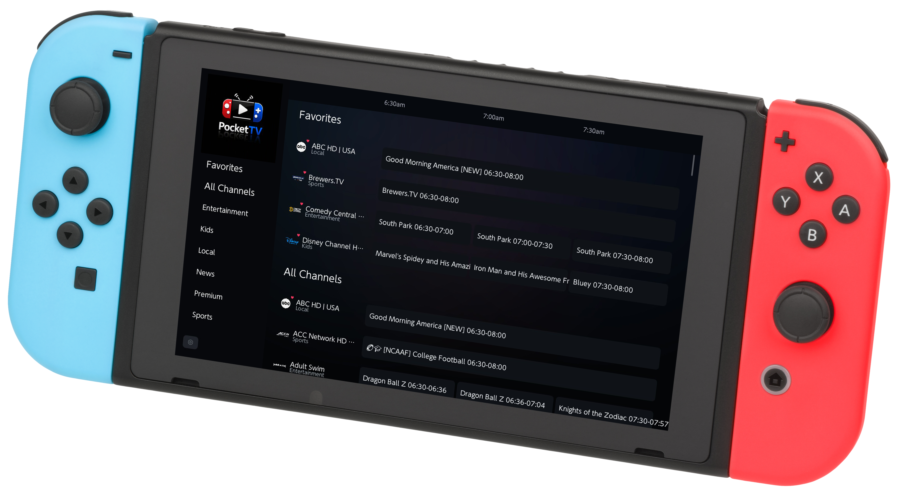

# PocketTV Releases

Public binary releases for PocketTV on Nintendo Switch.

Download the latest `PocketTV.nro` from the Releases page. Source code is maintained separately.

## Content Notice

PocketTV is a stream aggregation tool only. It does not host, produce, transmit, or store any media content.

All streams displayed within PocketTV are sourced directly from third-party providers over which PocketTV has no control, ownership, or affiliation. PocketTV acts solely as a viewer interface and does not have any agreements with content owners or broadcasters.

**The user assumes full and sole responsibility for:**

- The legality of accessing any stream in their country or jurisdiction
- Any content viewed through the application
- Compliance with local copyright, broadcasting, and media consumption laws

PocketTV makes no representations or warranties regarding the legality, accuracy, availability, or quality of any content accessible through the application. Access to certain streams may be restricted or unlawful depending on your location.

If you are a content owner and believe your content is being accessed without authorization through a third-party source listed in this application, please contact the respective stream provider directly.
